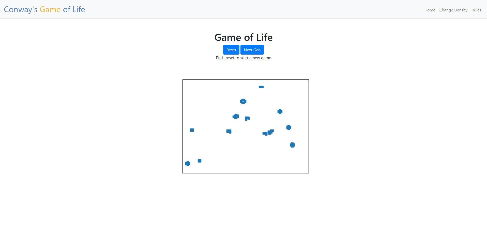
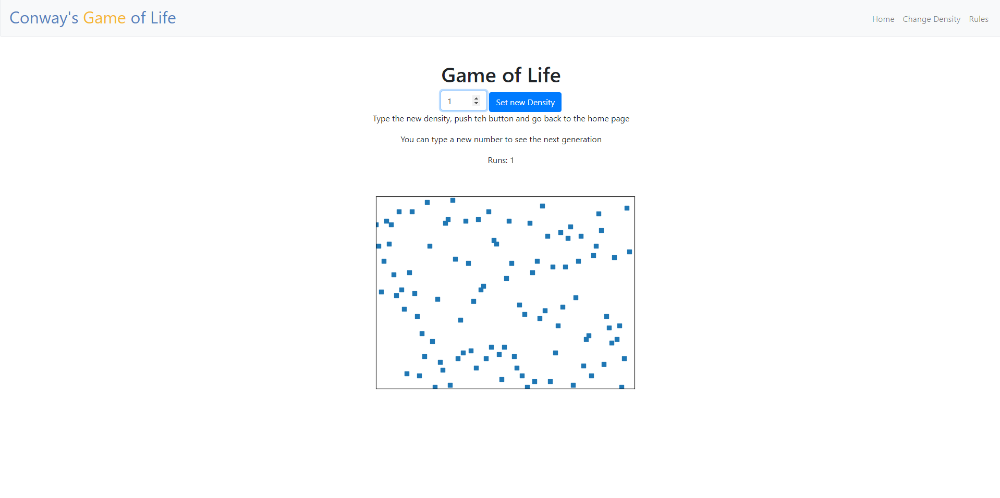
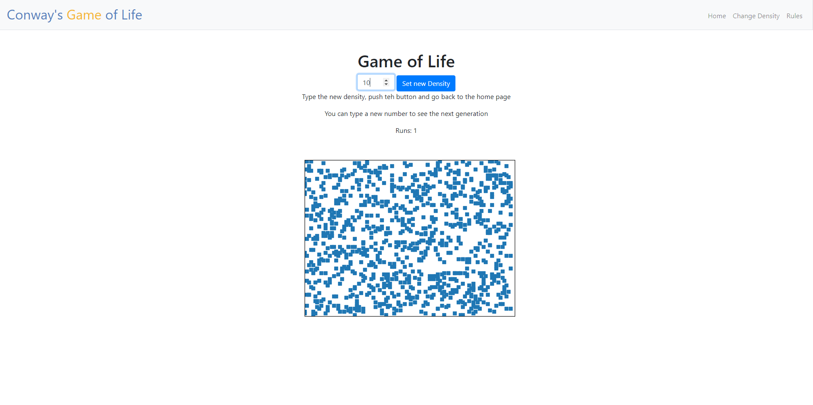
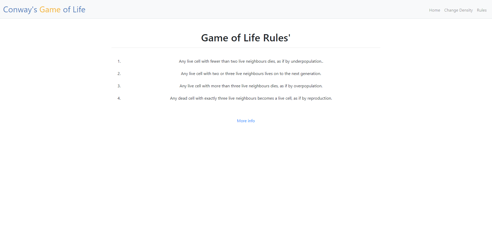

<!-- README.md is generated from README.Rmd. Please edit that file -->

# CS50 Projects

<!-- badges: start -->

<!-- badges: end -->

Example of a project

This project is a functional example of the game of life devised by John Conway made in Flask.
The way to run this app is download this repository in a folder, install flask and every other python library in requirements.txt
(you will have to install python as well).

## Home

It contains two buttons and a graphic.

The first button generates a sequence of random points between 0 and 100 in a bidimensional maxtrix

The second button iterates over these points applying the rules of the game of life (described in the third tab).

The third element is a graph generated in Python by matplotlib, showing the points as a square within the graph

## Density

The second tab contains an inputbox, a button and a graph

In the inputbox we can control the density of points within the graph, where 1 is a density of up to 100 points, 2 up to 200, and so on, the maximum value for this parametter is 10.

This component can also display a graph with density equal to number placed to give the user an idea of that change.

The second element is a button to place this new parameter inside the configuration

The graph has the same characteristics as in the previous window

## Rules

This section explains what the established rules are for the operation of this game and understand how it works.

